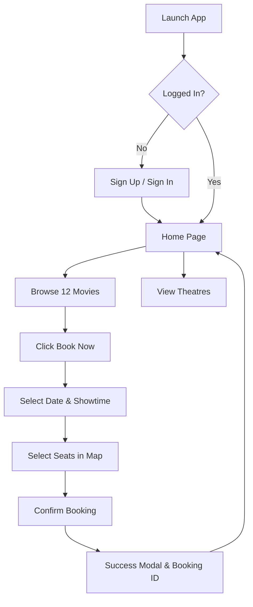
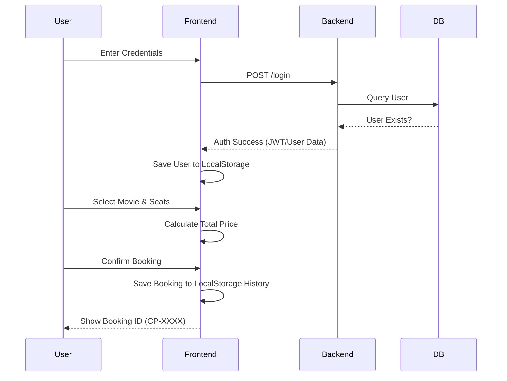

# Movie Booking Project Report 📜

This document provides a comprehensive overview of the **Movie Booking** (formerly CinePass) application, including technical architecture, software stack, and implementation details.

---

## 1. Technical Architecture (Arch Details)

The application follows a **Client-Server Architecture** with a clear separation between the frontend presentation layer and the backend authentication layer.

- **Frontend**: A Progressive Web App (PWA) that handles UI, user interactions, and the booking flow. It communicates with the backend for secure user login and registration.
- **Backend**: A RESTful API built with FastAPI that manages user identity and authentication.
- **Data Layer**: A PostgreSQL database (hosted on Neon) stores persistent user information.

---

## 2. Software Stack (Apps Used)

| Category | Technology | Purpose |
|----------|------------|---------|
| **Frontend** | HTML5, CSS3, JavaScript (ES6) | Structure, Styling (Glassmorphism), Logic |
| **Backend** | Python, FastAPI | High-performance REST API |
| **Database** | PostgreSQL (Neon) | Persistent user data storage |
| **PWA** | Service Workers, Web Manifest | Installation and offline capabilities |
| **Deployment** | Vercel | Frontend hosting & CDN |
| **Icons/Images** | Midjourney/DALL-E Style Generation | Cinematic movie posters and app icon |

---

## 3. Code Details (Key Components)

### Frontend Structure
- [index.html](file:///c:/Users/STUDENT/Desktop/Movie%20ticketbooking/frontend/index.html): Landing page with authentication modals.
- [home.html](file:///c:/Users/STUDENT/Desktop/Movie%20ticketbooking/frontend/home.html): Main dashboard showing **12 movies** and a **theatres** section.
- [booking.html](file:///c:/Users/STUDENT/Desktop/Movie%20ticketbooking/frontend/booking.html): Dynamic booking engine with seat mapping.
- [styles.css](file:///c:/Users/STUDENT/Desktop/Movie%20ticketbooking/frontend/styles.css): Global design system (colors, glassmorphism, animations).
- **sw.js & manifest.json**: Core PWA files for mobile installation.

### Backend Structure
- [main.py](file:///c:/Users/STUDENT/Desktop/Movie%20ticketbooking/backend/main.py): Entry point for FastAPI, containing `/register` and `/login` endpoints.
- **SQL Schema**: User table with hashed passwords for security.

---

## 4. Detailed Code Explanation

### A. Dynamic Data Binding (URL Parameters)
The application avoids hardcoding movie data on the booking page. Instead, it uses **URL Query Parameters**. When a user clicks "Book Now" on [home.html](file:///c:/Users/STUDENT/Desktop/Movie%20ticketbooking/frontend/home.html), it passes data like this:
`booking.html?title=Toxic&price=300&poster=img/toxic.png`
The booking page then uses `URLSearchParams` to extract this data and update the UI dynamically.

### B. Interactive Seat Mapping Logic
The seat map is generated using a nested loop in JavaScript:
- **Rows**: A to H (8 rows)
- **Columns**: 1 to 12 (12 columns)
- **Aisle Logic**: A gap is inserted after the 3rd and 9th seat in each row to create realistic theater aisles.
- **State Management**: When a seat is clicked, the [toggleSeat](file:///c:/Users/STUDENT/Desktop/Movie%20ticketbooking/frontend/booking.html#678-692) function adds/removes the seat ID from a `selectedSeats` array and calculates the total price: `SelectedSeats.length * TicketPrice`.

### C. Authentication Flow
- **Registration**: The frontend sends a JSON payload to the FastAPI `/register` endpoint. The backend hashes the password and stores it in the PostgreSQL database.
- **Login**: Upon successful login, the backend returns the user details. The frontend stores this in `localStorage` to keep the user "logged in" across different pages.
- **Route Guard**: A script at the top of [home.html](file:///c:/Users/STUDENT/Desktop/Movie%20ticketbooking/frontend/home.html) and [booking.html](file:///c:/Users/STUDENT/Desktop/Movie%20ticketbooking/frontend/booking.html) checks for the user in `localStorage`. If missing, it redirects them to [index.html](file:///c:/Users/STUDENT/Desktop/Movie%20ticketbooking/frontend/index.html).

### D. PWA (Progressive Web App) Implementation
- **Manifest**: Defines how the app appears when installed (icons, theme color, start URL).
- **Service Worker ([sw.js](file:///c:/Users/STUDENT/Desktop/Movie%20ticketbooking/frontend/sw.js))**: Intercepts network requests. It caches essential files ([index.html](file:///c:/Users/STUDENT/Desktop/Movie%20ticketbooking/frontend/index.html), [styles.css](file:///c:/Users/STUDENT/Desktop/Movie%20ticketbooking/frontend/styles.css)) so the app loads instantly on mobile even with a slow connection.

---

## 5. Flowchart (User Journey)

---

## 5. Data Flow (Dataflow)

---

## 6. Key Features (Missing Details)

- **Interactive Seat Map**: Custom-built JS map with aisle logic (8 rows × 12 columns).
- **Premium UI**: Dark mode with "Glassmorphism" effects, blue neon accents, and smooth hover animations.
- **PWA Capabilities**: 
    - Installable on Android & iOS homescreens.
    - App-like "Standalone" display mode.
    - Custom icon and splash screen.
- **Movie Catalog**: 12 curated movies across various genres with AI-generated cinematic posters.
- **Theatres Section**: Detailed theatre info with amenities like IMAX and 4K Laser.

---

## 7. Future Enhancements
1. **Backend Booking API**: Move booking storage from LocalStorage to the PostgreSQL database.
2. **Payment Gateway**: Integration with Razorpay/Stripe for real ticket purchases.
3. **QR Code Tickets**: Generate scanable QR codes in the success modal.
